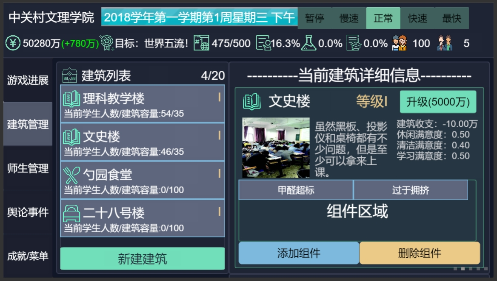
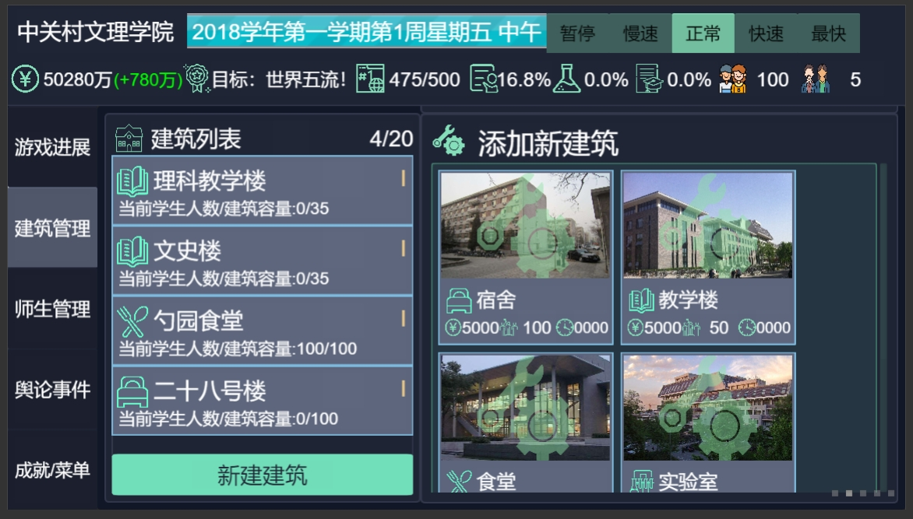
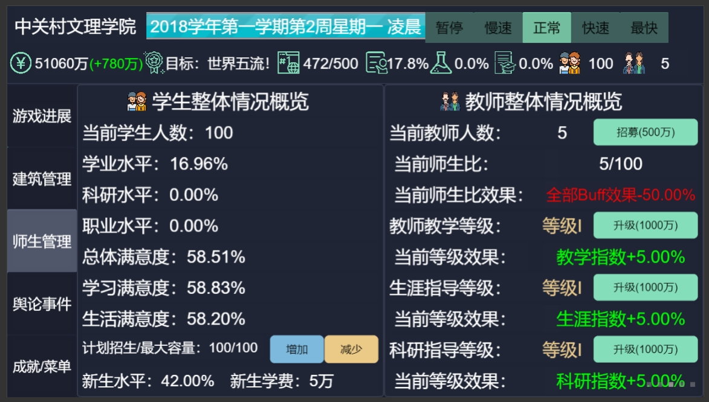
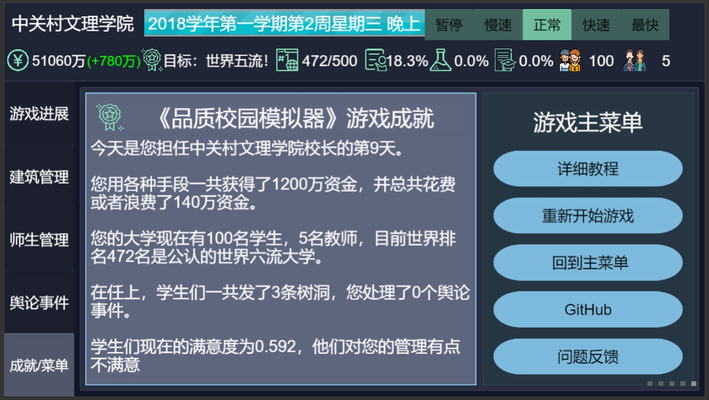

# Personal Portfolio
This repository serves as a personal portfolio of Pai Tong.

## 1. UniversitySim - a construction and management simulation game.
UniversitySim is a construction and management simulation game my team developed in my Lab on Software Engineering course. I am responsible for game logic design and development. All my contributions are in "PaiTong" branch.

Project website: https://se.jisuanke.com/hehao/universitysim
